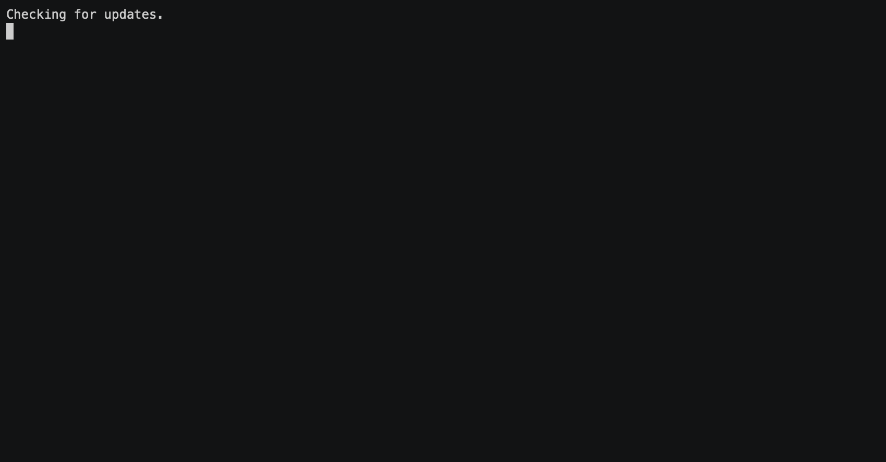

# ```Vanilla Node App```

[](https://patreon.com/lifefullofchange) [](https://ko-fi.com/lifefullofchange) [](https://github.com/johnhayesio/ama)     [](https://github.com/johnhayesio/vanilla-node-app)

> An app created with vanilla Node methods

## How to use

Execute app entry point (index.js) using NODE_ENV set to development or production:

```bash
NODE_ENV=development node index.js
```

## HTTPS protocol usage

In order to use the HTTPS protocol, a key and certificate must be created in a folder named https:

```bash
mkdir -p https
cd https

openssl req -newkey rsa:2048 -new -nodes -x509 -days 3650 -keyout key.pem -out cert.pem
```


